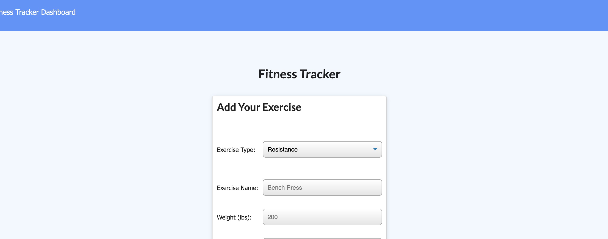
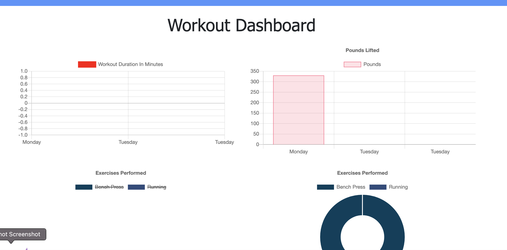

# Unit 17 NoSQL: Workout Tracker Application
​
---

​
1. [Description and User's Story](#description-and-user's-story)
2. [Functionalities](#functionalities)
3. [Dependencies and Libraries](#list-of-dependencies-and-libraries) 
4. [Installation](#installation)
5. [Demo](#demo)
6. [Licenses](#licenses)
7. [Credits and Acknowledgements](#credits-and-acknowledgements) 
​

​
---
​
## Description and User's Story 
​

​
​
``
AS a fitness amateur,
I NEED an application that can track my workout routines
AND displays my fitness statistics on a visual dashboard.  
``
​

​
**Fitness Tracker** is a web application where the user can register resistance and/or cardio workout routines and keep track of their exercises statistics. The application displays the stats of the current exercise and displays them through a variety of visual tools, such as piecharts and linecharts.  
​

​
---
​
## Functionalities
​
Currently, the system offers the following *features*:
​
* Users can create a new workout routine and input the exercise's info (weight, distance, duration, sets, repetitions and time).
* Users can continue doing the same workout or create a new routine. 
* All routines and workouts are stored in a database and their statistics are displayed inn linecharts and piecharts on a separate dashboard. 
​

​
---
​
## Dependencies and Libraries
​
The application was designed and programmed through a combination of *JavaScript*, *pure HTML*, *pure CSS*, *Express*, *Node.Js* and *Bootstrap*. The database functionality was developed using MongoDB and the mongoose npm library. The application is functional and hosted in a *Heroku* external server.
​
​
---
​
## Installation
​
If you are interested in running **DentApp** locally, you can follow these steps:
​
1. Clone or download the repo.
​
2. Using your terminal, navigate into the main repository and run `npm install` in order to install all npm and NodeJS dependencies and libraries (you may also need to install MongoDB or change the database dialect of the schema file).
​​
4. After everything is set, you can then run the application `server.js` using Node in your terminal. After, navigate to your localhost connection on your preferred web browser. 
​
Or, alternatively, you can use the demo page we deployed on a [Heroku](https://www.heroku.com/platform) external server. You can access the functional app [here](https://pacific-thicket-69674.herokuapp.com/?id=602b5cebdd13f30015a317fa). 
​

​
---
​
​
## Demo
​
The following Gif provides a demonstration of the application's functionalities:

​

​

​
---
​
## Licenses
​

​
​

​
​

​
---
​
## Future Development
​
These are some improved functionalities we want to add to the project in the near future:
​
* Integrate appointment management through each specific user. As of right now, all users are integrated into a global database that shares appointments, services, and patients. The goal is for each user to display their own patients and appointments.
​
* Only one service per patient can be created. In the future, we would like to add more than one service to each patient.
​
* Integrate files for each patient, showing their service/treatment history. In addition, we want to add some kind of documentation visualizer so users can access patients' documents (for example, reports or X-Ray charts).
​
* Create a payment and balance system for appointments showing patients' current or pending payments and total balance owed. 
​
* General improvement to user's functionalities and interface: a status showing what user is logged in, and a functionality to edit or add users' information to the profile page.
​
* Integrate medical inventory to services: costs of materials needed for treatments, status of available materials, and capacity to order/reorder more inventory. 
​
* Integrate an email/calendar system for patients: send email remainders to patients about upcoming appointments and develop a connection to a calendar API that can help patients integrate their appointments to their schedules. 
​
* Create a separate User system for clients, so they can also access their information, balance account, and appointments online. 
​

​
---
​
## Credits and Acknowledgements
​
This project was expanded and finished, from the base assignment code, by:
​
* **Mario N. Castro Villarreal** [Github: mncastro](https://github.com/mncastro)
​
